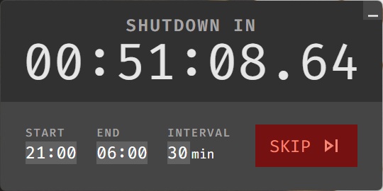

# Fix Your Sleep Schedule

----
I used to stay up late on my computer watching random youtube videos, scrolling reddit, or finding some other novel way to get dopamine at 1am.

I decided to use the windows task scheduler to shut down my computer at 11pm every day.

It worked pretty well, but it had one main problem: often I would turn my computer back on after 11 if I needed to get work done. Then when I finished my work, I would go back to youtube/reddit/etc...

The only solution I saw was to create a task to shut down my computer every 30 minutes/hour, but then when I was doing work I would have to disable them.

After I would disable them, I would forget or be too lazy to re-enable them for several days, losing productivity. I couldn't figure out how to automatically re-enable them, and managing 16 tasks was tedious already, so I bit the bullet and created this.

### Introducing: Fix-Your-Sleep-Schedulinator-3000???

Here's how it works:
- Set your wakeup time and bedtime
- Set how often you want your computer to turn off (let's call this X)
- After (& including) your bedtime, your computer will shut off every X minutes until your wakeup time.
- If you are doing actual work, you can skip the next shutdown

"But why wouldn't you just always skip the next shutdown?" you ask. I find that when I'm engrossed in a modern day skinner box such as youtube, I totally forget that my computer is about to shut down. When it does, I'm too lazy to turn it back on. (It helps to keep your laptop folded up in one of [these](https://smile.amazon.com/Vertical-Adjustable-OMOTON-Aluminum-Chromebook/dp/B0769G51R7).)

Problem solved!

### Install from the releases page [here](https://github.com/SimonBerens/sleep/releases).

#### Note: This desktop app starts minimized and minimizes itself when you click away from it so that you don't look at the countdown.

### Bugs/Annoyances
- App is not signed
- Auto start does not work on linux (please lmk if you know how to fix this!)
